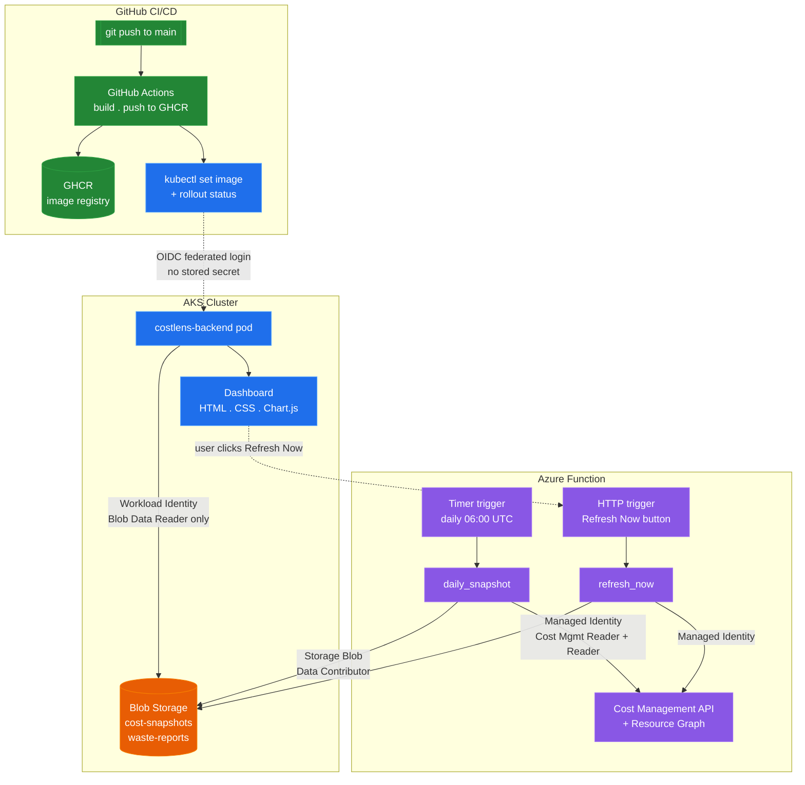

# CostLens


[](https://github.com/shri-hari27/costlens/actions/workflows/backend-ci.yml)

A live Azure FinOps dashboard on AKS: real month-to-date spend pulled
straight from the Cost Management API, automated waste detection across
your actual subscription (unattached disks, orphaned public IPs, VMs left
running), and a "Refresh Now" button that triggers a fresh data pull on
demand — all served from a self-hosted dashboard authenticating to Azure
with zero stored credentials.

## Contents
- [What this demonstrates](#what-this-demonstrates)
- [Architecture](#architecture)
- [Screenshots](#screenshots)
- [Security model](#security-model)
- [Proven, not just designed](#proven-not-just-designed)
- [Repo structure](#repo-structure)
- [Reproducing it locally](#reproducing-it-locally)
- [What I'd add with more time](#what-id-add-with-more-time)
- [Notes on constraints](#notes-on-constraints)

## What this demonstrates

Most cost-visibility demos show a static screenshot of a Cost Management
blade. This one is a real, running system: an Azure Function pulls fresh
spend and waste data from your live subscription on a schedule (or on
demand), writes it to Blob Storage, and a Go backend running on AKS serves
it to a dashboard that renders it — no mock data, no hardcoded numbers.
The point isn't just "I can call an Azure SDK" — it's the architecture
around it: two identities scoped to exactly what each component needs,
OIDC everywhere instead of stored secrets, and a UI that turns raw API
output into something a finance or platform team would actually want to
look at every morning.

## Architecture



**Component choices:** AKS over a self-managed k3s VM — this project's
whole point was to demonstrate managed control plane + **Workload
Identity**, the current, credential-free way to give a pod access to
Azure resources (the modern replacement for the deprecated AAD Pod
Identity pattern). Push-based CD (`kubectl set image`) instead of Argo CD
— a deliberately different pattern from a companion project
([OrderPulse](https://github.com/shri-hari27/orderpulse)) that uses
pull-based GitOps, to show range rather than one tool for every job.
Vanilla JS + Chart.js, no npm build step — a hand-styled dashboard is
visually indistinguishable from a React one in a live demo, and it
removes an entire category of tooling problems for a project this size.

## Screenshots

<table>
<tr>
<td width="50%">

**1. Dashboard overview**

Month-to-date spend, daily trend, and spend-by-resource-group at a glance.

</td>
<td width="50%">

**2. Waste Radar**

Real findings from Resource Graph, each with a one-click-to-copy `az` fix command — never executed automatically.

</td>
</tr>
<tr>
<td width="50%">

**3. Live refresh in action**

"Refresh Now" triggers the Function's HTTP endpoint directly from the browser and reloads with fresh data.

</td>
<td width="50%">

**4. GitHub Actions — OIDC deploy**

Build → push to GHCR → OIDC login to Azure → rollout, no stored service-principal secret anywhere in the pipeline.

</td>
</tr>
</table>

## Security model

Two managed identities, scoped to exactly what each component touches —
nothing shared, nothing broader than it needs to be:

| Identity | Used by | Permissions | Why |
|---|---|---|---|
| `costlens-function-identity` | Azure Function | Cost Management Reader, Reader, Storage Blob Data **Contributor** | Needs to read subscription-wide cost/resource data and write snapshots |
| `costlens-backend-identity` | AKS pod (Workload Identity) | Storage Blob Data **Reader** only | Only ever reads what the Function already published — no cost/resource API access, no write access |

If the AKS pod were ever compromised, it cannot query your subscription's
billing or resource data directly — it can only read the JSON the
Function already chose to publish to Blob Storage. That boundary is a
deliberate design choice, not an accident of scope.

Both GitHub Actions and the AKS pod authenticate via **OIDC federation** —
zero long-lived secrets stored anywhere in the pipeline or the cluster.

## Proven, not just designed

This was tested against a real, live subscription — not seeded with mock
data:

| Test | Result |
|---|---|
| **End-to-end data pull** | `POST /api/refresh` → Function queried Cost Management + Resource Graph live, wrote snapshot to Blob, backend served it → dashboard rendered real spend and waste findings |
| **Waste detection accuracy** | Correctly flagged 2 running VMs on first run (including catching its own build VM); after adding a running-state filter and an exclusion list, correctly dropped to 0 findings once the flagged VMs were no longer eligible |
| **Workload Identity boundary** | Confirmed the AKS pod's Blob-only identity cannot reach Cost Management or Resource Graph — only the Function's broader identity can |
| **GitHub OIDC trust** | First CI/CD run failed against GitHub's new immutable OIDC subject-claim format (rolled out July 2026); diagnosed from the exact `AADSTS700213` error and fixed by updating the Azure federated credential subject — pipeline has run clean since |

## Repo structure
costlens/
├── backend/ Go service: static dashboard + Blob-reading API
│ ├── main.go
│ ├── Dockerfile
│ └── static/ index.html, style.css, app.js
├── functions/ Azure Function (Python v2 model)
│ ├── function_app.py timer + HTTP triggers
│ ├── shared_logic.py Cost Management + Resource Graph queries
│ └── requirements.txt
├── k8s/ Deployment, Service, ServiceAccount manifests
├── infra/ Terraform: AKS, Storage, Function App, identities
├── docs/ screenshots
└── .github/workflows/
└── backend-ci.yml OIDC login → build/push GHCR → kubectl deploy
## Reproducing it locally

1. `cd infra && terraform init && terraform apply` — provisions AKS,
   Storage, the Function App, and both managed identities.
2. `cd functions && func azure functionapp publish <function-app-name> --python --build remote` —
   deploys the Function code (zip-deploy via `az` doesn't reliably index
   Python v2 model functions; Core Tools does).
3. `az aks get-credentials` then `kubectl apply -f k8s/` — deploys the
   ServiceAccount, Deployment, and Service to the cluster.
4. Push to `main` — GitHub Actions builds the backend image and rolls it
   out automatically via OIDC, no manual `kubectl` needed after the first
   apply.
5. Hit the Function's `/api/refresh` endpoint once to populate the first
   snapshot, then open the Service's external IP.

## What I'd add with more time

- A static IP or shared ingress domain for the AKS Service, so the
  dashboard and Function don't need a CORS rule tied to a LoadBalancer IP
  that could change if the Service is ever recreated.
- Alerting on the waste findings themselves — a weekly summary emailed or
  posted to Slack instead of requiring someone to open the dashboard.
- A second Function region or a retry queue, so a transient Cost
  Management API failure doesn't silently skip a day's snapshot.
- Historical trend storage beyond 14 days, with the option to compare
  month-over-month instead of only the current period.
- Real authentication on the dashboard itself — it's currently open to
  anyone with the IP, fine for a portfolio demo, not for production.

## Notes on constraints

Built on a subscription with hard, non-adjustable quota limits discovered
mid-build: v7-generation VM SKUs only, a 4-vCPU regional ceiling, and a
zero-quota App Service plan in the original region. AKS runs on a single
node and the Function App lives in a different region from the rest of
the stack as a direct result — both documented here rather than treated
as unexplained scope cuts.

## Troubleshooting journal

This project hit more real infrastructure friction than a clean tutorial
would suggest — left in here deliberately, since diagnosing and working
around platform constraints is a core part of the job.

### VM size unavailable across multiple regions/SKUs

**Symptom:** `az vm create` failed with `SkuNotAvailable` for
`Standard_D4s_v3` in `southeastasia`, then again for `D4s_v5` and
`D2s_v5` in `eastus`.

**Diagnosis:**
```bash
az vm list-usage --location eastus --output table | grep -i "Standard D"
```
Revealed every D-family was hard-capped at **4 vCPUs total** on this
subscription — a quota ceiling, not a capacity issue, so retrying
different sizes in the same families kept failing the same way.

**Fix:** created the VM through the Azure Portal instead, which surfaces
only the sizes actually deployable for the subscription. The portal
allowed `Standard_D2ads_v7` — revealing the subscription is restricted to
**v7-generation SKUs only**; `_v3`/`_v5` families were never going to
work regardless of region.

---

### Terraform: resource provider registration failure

**Symptom:**Error: Error ensuring Resource Providers are registered.
Cannot register providers: Microsoft.Media, Microsoft.MixedReality, Microsoft.TimeSeriesInsights**Cause:** `azurerm` tries to auto-register *every* resource provider it
supports by default, including ones this build never touches. The
subscription lacked permission to register a few of them.

**Fix:** disabled auto-registration and registered only what the project
actually needs:
```bash
# provider.tf
provider "azurerm" {
  features {}
  skip_provider_registration = true
}
```
```bash
az provider register --namespace Microsoft.Storage --wait
az provider register --namespace Microsoft.ContainerService --wait
az provider register --namespace Microsoft.Compute --wait
az provider register --namespace Microsoft.Network --wait
az provider register --namespace Microsoft.Web --wait
az provider register --namespace Microsoft.CostManagement --wait
az provider register --namespace Microsoft.ManagedIdentity --wait
```

---

### AKS: preview API version rejected

**Symptom:**
Code="NoRegisteredProviderFound" Message="No registered resource provider
found for location 'eastus' and API version '2023-04-02-preview'..."
— despite `Microsoft.ContainerService` confirmed `Registered`.

**Diagnosis:** an older `azurerm` provider version (`~> 3.85.0`) was
calling a preview API this subscription doesn't have access to.

**Fix:** bumped the provider version:
```hcl
azurerm = {
  source  = "hashicorp/azurerm"
  version = "~> 3.117.0"
}
```
```bash
terraform init -upgrade
```

---

### AKS: VM size and vCPU quota, twice

**Symptom 1:**
"The VM size of Standard_D2s_v3 is not allowed in your subscription in
location 'eastus'. The available VM sizes are '...standard_d2ads_v7...'"

Fixed by switching `aks_vm_size` to `Standard_D2ads_v7` — same
v7-only restriction discovered during VM creation, now confirmed for
AKS node pools too.

**Symptom 2, immediately after:**

"Insufficient regional vcpu quota left for location eastus. left regional
vcpu quota 2, requested quota 4."

The build VM was already consuming 2 of the subscription's 4-vCPU
regional allowance, leaving no room for a 2-node pool.

**Fix:** dropped `aks_node_count` from 2 to 1 — fits exactly within the
2 vCPUs remaining. A portfolio/demo cluster doesn't need multi-node
redundancy to prove the architecture.

---

### Function App: zero App Service quota in the primary region

**Symptom:**

"Operation cannot be completed without additional quota.
Current Limit (Total VMs): 0"

while creating the Consumption-plan Function App in `eastus`.

**Fix:** moved just the Function App's resources (storage account,
service plan, function app) to `centralindia`, which had quota
available. The Function talks to Azure APIs over the internet regardless
of region, so co-location with AKS wasn't a real requirement — a
deliberate tradeoff, not an oversight.

---

### Function code silently not deploying (404 on every route)

**Symptom:** the Function App showed `State: Running`, but every route
returned `404 Not Found`, and `az functionapp function list` returned
empty.

**Diagnosis:** `az functionapp deployment source config-zip` uploaded a
zip and reported success, but never actually ran the Oryx build that
installs Python dependencies and indexes the v2-model functions — the
build log showed it skipped straight past the pip-install step.

**Fix:** used the dedicated Azure Functions Core Tools instead, which
handles the Python v2 programming model correctly:
```bash
curl https://packages.microsoft.com/keys/microsoft.asc | gpg --dearmor > microsoft.gpg
sudo mv microsoft.gpg /etc/apt/trusted.gpg.d/microsoft.gpg
sudo sh -c 'echo "deb [arch=amd64] https://packages.microsoft.com/repos/microsoft-ubuntu-$(lsb_release -cs)-prod $(lsb_release -cs) main" > /etc/apt/sources.list.d/dotnetdev.list'
sudo apt-get update
sudo apt-get install -y azure-functions-core-tools-4
```
```bash
func azure functionapp publish costlens-func-frm34u --python --build remote
```
This ran a real remote `pip install` and correctly synced both triggers
— `config-zip` should be treated as unreliable for the Python v2 model on
Linux Consumption plans.

---

### GitHub OIDC: new immutable subject-claim format

**Symptom:** the first CI/CD run failed at Azure login with:

AADSTS700213: No matching federated identity record found for presented
assertion subject 'repo:shri-hari27@62689707/costlens@1324245626:ref:refs/heads/main'.

— despite the federated credential subject being set correctly to
`repo:shri-hari27/costlens:ref:refs/heads/main`.

**Cause:** GitHub repos created after July 15, 2026 issue OIDC tokens
with an immutable subject format that embeds numeric owner/repo IDs
instead of plain names — a platform-wide change, not a misconfiguration.

**Fix:** read the exact subject GitHub was actually sending straight out
of the error message, and updated the Azure federated credential to
match:
```bash
az ad app federated-credential delete \
  --id ad05ceb1-e48b-4be0-866b-99a00b5cb006 \
  --federated-credential-id costlens-github-main

az ad app federated-credential create \
  --id ad05ceb1-e48b-4be0-866b-99a00b5cb006 \
  --parameters '{
    "name": "costlens-github-main",
    "issuer": "https://token.actions.githubusercontent.com",
    "subject": "repo:shri-hari27@62689707/costlens@1324245626:ref:refs/heads/main",
    "audiences": ["api://AzureADTokenExchange"]
  }'
```

---

### Waste detector flagging its own build VM

**Symptom:** the first live run correctly found 2 "running VM" waste
findings — but one of them was `costlens-build-vm`, the VM this whole
project runs on, and the other was a VM that was actually already
deallocated.

**Fix:** tightened the Resource Graph query to filter for genuinely
running state, and added an explicit exclusion for the build VM:
```kql
Resources
| where type =~ 'microsoft.compute/virtualmachines'
| extend powerState = tostring(properties.extended.instanceView.powerState.code)
| where powerState =~ 'PowerState/running'
```
```python
EXCLUDED_VM_NAMES = {"costlens-build-vm"}
...
if vm_name in EXCLUDED_VM_NAMES:
    continue
```
